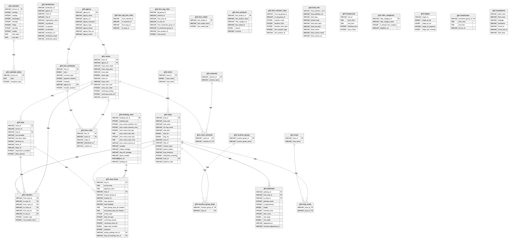

# duckdb-gtfs
Loading and analyzing GTFS Schedule data with DuckDB.

## GTFS Schedule DuckDB database
This projects provides an empty DuckDB database that contains the necessary tables and their relations for GTFS Schedule datasets. It can be found at [database/gtfs.duckdb](database/gtfs.duckdb).

The SQL script that created the DuckDB database can be found at [scripts/create_gtfs_database.sql](scripts/create_gtfs_database.sql). It's directly derived from the [official GTFS Schedule Field Definitions docs](https://gtfs.org/documentation/schedule/reference/#field-definitions).

The Entity Relationship Diagram looks like this:


## Loading an example dataset
To show the GTFS Schedule database can be used, this repo contains an example of how to transform and load a public dataset.

There’s a [German dataset](https://gtfs.de/de/feeds/de_full/) that contains the full train and local traffic for Germany. It contains more than 32 million stop times,  1.6 million trips, and 663 thousand stops.

### Usage
First, you need to clone this git repo locally. Then you can run the 
[scripts/providers/gtfs-de/full/download_data.sh](scripts/providers/gtfs-de/full/download_data.sh) script to download the data to the [source-data/providers/gtfs-de/full](source-data/providers/gtfs-de/full) directory.

After that, you can load the data to a copy of the pre-existing GTFS database with the following command:

```bash
scripts/providers/gtfs-de/full/create_database.sh
```

The database will be written to `exported-data/providers/gtfs-de/full/data.duckdb`.

Once this is done, you can open the DuckDB CLI to query the data:

```bash
$ duckdb exported-data/providers/gtfs-de/full/data.duckdb
```

### Creating a "view database"
DuckDB can also be used to create a lightweight "view database" that contains only references to the actual data, hosted on object storage like S3 or R2.

The process to create such a "view" database consists of four main steps:

1. Exporting the data from a database as Parquet files.
2. Uploading the exported Parquet files to an object storage service.
3. Creating the database file containing the views to the object storage files.
4. Uploading the new database file to object storage as well, to be able to use the [ATTACH](https://duckdb.org/docs/stable/sql/statements/attach.html#attach) statement of DuckDB.

With our example dataset, if the above steps to create the basic database have been run, you can do the following:

1. Run the `scripts/providers/gtfs-de/full/export_data.sh` script. This will export the data as one Parquet file per table.
2. Upload the Parquet files to an object storage service.
3. Edit the `scripts/providers/gtfs-de/full/create_view_database.sh` script to match the location of your object storage uploads, and run the script.
4. Upload the resulting database file [exported-data/providers/gtfs-de/full/database.duckdb](exported-data/providers/gtfs-de/full/database.duckdb) to your object storage as well.

